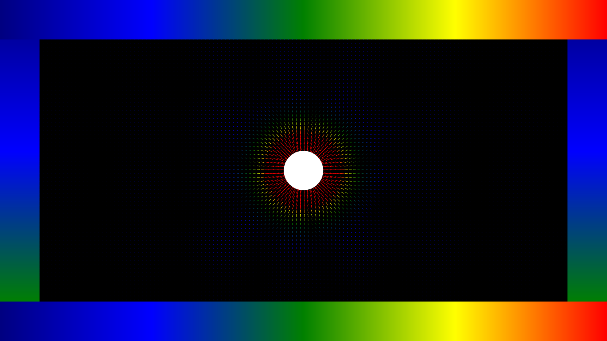

# Electric Fields
There are 2 separate but similar projects in this repo.

<h3>Python Field Calculator</h3>
The coulomb.py file takes in <i>n</i> charges and calculates the electric field at any point in space due to those charges.

<h3>Canvas Field Visualisation</h3>

The HTML, CSS and JS files use the same maths to visualise the electric field vectors in a plane (and you can add your own charges too).

